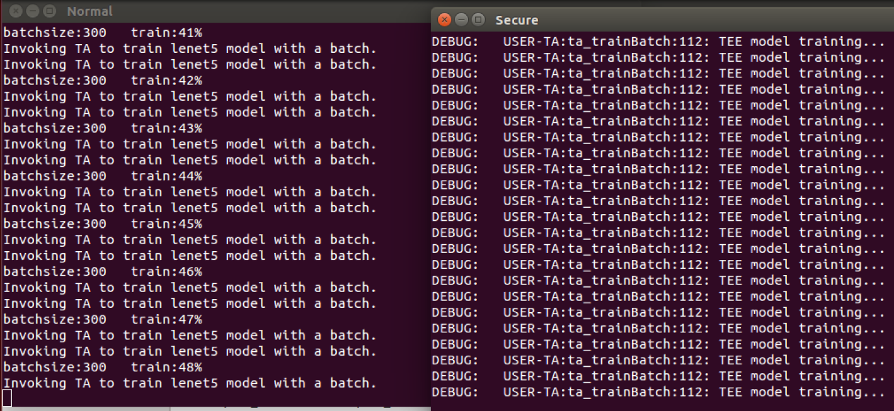
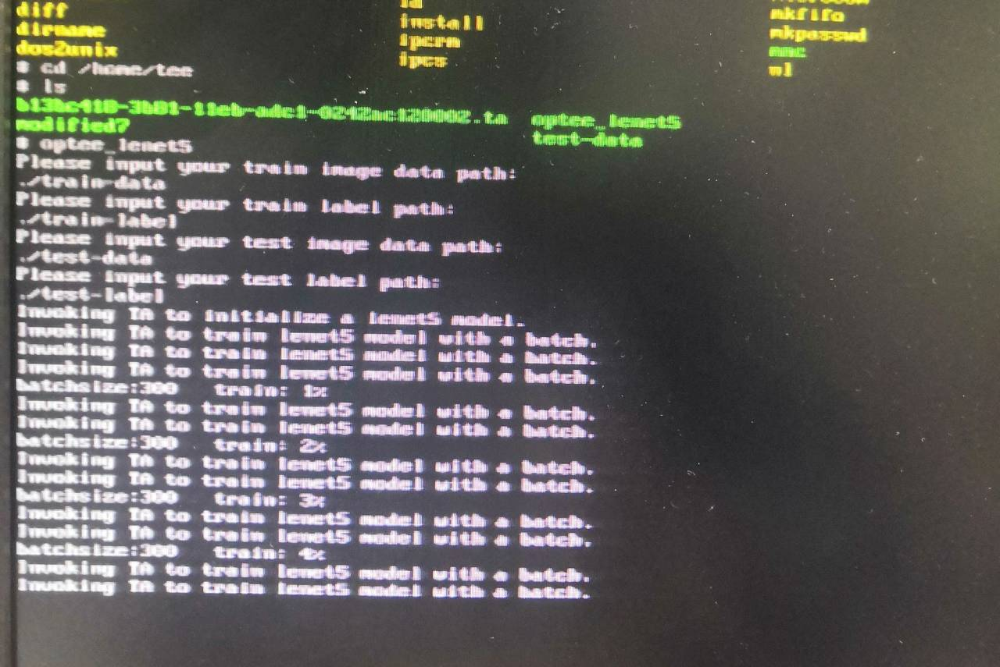

# Lenet5_in_TEE

## 一、初步分析

### 1. 一般环境下的Lenet5源码

##### 代码来源

本应用中使用的Lenet5源码来自于https://github.com/fan-wenjie/LeNet-5

该项目使用**C语言**完成，没有依赖第三方库，在windows和Linux环境下通过简单的编译和极少的改动即可正确运行

##### 代码结构

代码结构如下：

- lenet.h：定义结构变量，提供神经网络接口
- lenet.c：实现卷积神经网络的主要计算功能，提供初始化、训练和预测接口的具体实现
- main.c：打开训练集并分组，调用卷积神经网络接口训练模型，并针对测试集给出预测结果
- 训练集与测试集

##### 执行分析

程序运行一次的执行流程如下：

1. 读取数据集（训练集和测试集）
2. 模型初始化
3. 训练集分组
4. 训练模型
5. 模型测试
6. 统计数据

### 2. TEE中的Lenet5

##### 总体目标

现有的代码可以在Rich OS中编译执行，但不可以直接放在TEE环境中执行。

本项目的目标是将卷积神经网络的计算过程与TEE（可信执行环境）相结合，作为TEE实验的初次尝试。

##### 项目规划

一个TEE中的安全应用分为两部分，分别是在安全环境中执行的**安全应用TA**和在非安全环境中执行的**客户应用CA**

2. TEE通过共享内存的方式与Linux中的应用进行通信，共享内存的大小有限；

3. CPU在安全世界和非安全世界之间进行一次切换需要进行多次系统调用和上下文切换，频繁切换会带来性能上的损耗

考虑到以上几点因素，TEE中的代码应该尽量少，即只将关键的功能函数放入TEE执行。同时，衡量第12点带来的数据大小的限制和第2点带来的性能损耗，提出的第一个设计方案如下：

- 训练阶段
  - 客户应用CA：打开整个训练集并进行分组，调用TA中的接口进行训练
  - 安全应用TA：每次接收一组数据，对模型进行训练，模型参数保存在TEE内部以利用TEE的安全性，除了执行结果不返回任何值
- 测试阶段
  - 客户应用CA：打开整个测试集并进行分组，调用TA中的接口进行预测
  - 安全应用TA：接受一组数据，使用训练好的模型进行预测，返回预测结果

### 3. 实现步骤

1. ta/lenet5_ta.c：参考OP-TEE的样例程序，完成TA中必要的入口函数，并向 Client 提供三个功能调用接口：模型初始化接口、训练模型接口、预测接口（具体功能暂不实现）
2. host/main.c：修改原lenet5程序的main.c作为Client APP，负责打开文件，分组调用TA中的接口完成训练、预测的功能。
3. ta/lenet5_ta.c：框架完成以后，实现TA中具体的功能函数。在这些函数中需要检查参数确保安全性，最终调用原lenet.c中实现的功能完成函数需求。
4. 编译newlib开源程序库，为lenet5中需要的exp、sqrt等数学运算提供支持

### 4. 主要问题

##### ① 参数的传递

CA每次调用TA时可以提供四个参数，每个参数仅有64位的地址空间，可以用来传递两个32位int，或者提供一片共享内存的缓冲区（起始指针和缓冲区大小），内存在共享时受到OP-TEE OS的保护，除了TA和CA，其他程序无法访问或篡改。在本实验中由于数据量很大，显然缓冲区更适合作为参数

##### ② 数学库

C语言的标准库有libc和libm两种，<math.h>位于libm中。

lenet5的源码需要使用exp、sqrt两个浮点运算函数，不可避免地使用了<math.h>头文件。在Linux中编译时，可以通过GCC -lm的参数设置找到libm。

但是，OP-TEE中仅有对libc的支持，没有libm，于是我们需要手动地实现这两个函数，或者将开源的数学库编译成静态库加入到OP-TEE的源码当中。

###### 静态链接库

为了满足日后可能使用其他数学算法库的需要，这里首先尝试了使用加入静态库的方法：

- newlib是一个广泛应用于嵌入式系统的开源C语言库，其中包含了对libm的支持。我尝试在ubuntu虚拟机中将newlib编译到ARM内核上，但是编译过程中遇到了一些问题，没有成功。nwelib的官方文档关于交叉编译的内容极少，因此尝试了一段时间后决定将其搁置

###### 添加函数

由于newlib编译失败，为了不影响整体进度，决定手动添加的sqrt和exp的函数实现代替<math.h>使安全应用能够正常运行起来，后续回顾时再考虑静态库的编译。

最终采用的解决方案是引用了另一个开源数学运算库fblibm的头文件和两个运算函数，加入到TA的源码中替代<math.h>

在Windos下对使用fblibm函数和使用<math.h>的两种模型进行对比，发现该函数和库文件中的函数性能差别不大：

|                |  fblibm  |  标准库  |
| :------------: | :------: | :------: |
| 平均预测准确率 | 96.99 %  | 97.15 %  |
|   平均总耗时   | 81.971 s | 82.072 s |

##### ③ rand() 函数

在lenet5模型中需要使用随机数来为模型赋初始值，编译过程中发现 srand()、rand() 等函数在TEE中都是未实现的函数（虽然这些函数属于libc而非libm）。查阅GPD_TEE_Internal_Core_API_Specification后得知，TEE内部将随机数的生成封装在了TEE_GenerateRandom API中，这个API可以在指定起始地址和长度的缓冲区上生成随机的数据。因此修改源文件，使用此API代替原来的rand()，生成32位的随机数：

~~~c
/* Use TEE_internal_core_API TEE_GenarateRandom*/
static unsigned rand(void)
{
	unsigned res;
	TEE_GenerateRandom(&res, sizeof(unsigned));
	return res;
}
~~~

##### ④ TA崩溃问题

解决了库函数的问题之后，整个TA已经可以正常地编译运行，但在运行过程中遇到了一些问题：

首先是在模型初始化的时候程序崩溃：

> REE: Invoking TA to initialize a lenet5 model.
>
> REE: TEEC_InvokeCommand failed with code 0xFFFF3402 origin 0x03.

通过在TEE中打印更多信息发现，调用TEE_Malloc函数为lenet5模型分配内存时，返回的地址是0：

> TEE: Lenet5 TA is created!
>
> TEE: ta_init:85: Lenet5 initializing...
>
> TEE: ta_init:95: Memory allocated at 0x0

这导致后续更改模型参数的时候产生了非法的访问，发生段错误。

查阅OP-TEE官方QA和其他资料后意识到可能是需要的内存超出了TA的数据段大小。

lenet5.h中定义的LeNet5模型占据了 405*1024 = 415216Bytes 的内存空间。而我们先前在user_ta_header_defines.h中定义了如下的堆栈大小：

~~~c
/* Provisioned heap size for TEE_Malloc() and friends */
#define TA_DATA_SIZE			(32 * 1024)

/* Provisioned stack size */
#define TA_STACK_SIZE			(2 * 1024)
~~~

32KB的数据段不足以分配LeNet5所需的内存，因此返回0指针，导致程序崩溃。因此我们修改如下：

~~~c
/* Provisioned heap size for TEE_Malloc() and friends */
#define TA_DATA_SIZE			(512 * 1024)
~~~

程序即可正常运行。

后续进行到模型训练步骤时出现了同样的崩溃问题，根据前面的经验阅读代码发现，训练模型时，TrainBatch 函数中定义了一些 LeNet5 和 Feature 类型的临时变量。C语言中的临时变量将会分配在程序的栈空间中，而我们定义的栈空间仅有 2KB，因此导致栈溢出，程序崩溃。

计算得知，函数调用过程中使用的临时变量最多占用 2 * sizeof(LeNet5) + 2 * sizeof(Feature) = 952*1024 = 974976 Bytes，在此基础上留有一些富余，我们将栈空间大小改为 1 MB：

~~~c
/* Provisioned stack size */
#define TA_STACK_SIZE			(1024 * 1024)
~~~

再次编译后重新运行，程序开始正常工作：

### 5.其他事项

##### Qemu中的编译

除了添加TEE_source_code到optee_examples中，还需要对qemu-optee工程中的两个Makefile文件做出修改，使训练和测试用的数据能够被加载到qemu中：

- 将训练-测试数据放到optee_examples/lenet5/data/目录下

- 在optee_examples/Makefile中添加如下内容：

  ~~~makefile
  prepare-for-rootfs: examples
  	echo "Copying example CA and TA binaries to $(OUTPUT_DIR)..."
  	@mkdir -p $(OUTPUT_DIR)
  	@mkdir -p $(OUTPUT_DIR)/ta
  	@mkdir -p $(OUTPUT_DIR)/ca
  	@mkdir -p $(OUTPUT_DIR)/data # Add data.
  	@for example in $(EXAMPLE_LIST); do \
  		if [ -e $$example/host/optee_$$example ]; then \
  			cp -p $$example/host/optee_$$example $(OUTPUT_DIR)/ca/; \
  		fi; \
  		cp -pr $$example/ta/*.ta $(OUTPUT_DIR)/ta/; \
  		 # Copy data into OUTPUT_DIR.
  		if [ -e $$example/data ]; then \
  			cp -pr $$example/data/* $(OUTPUT_DIR)/data/; \
  		fi; \
  	done
  ~~~

- 修改build/qemu.mk，添加如下内容：

  ~~~makefile
  filelist-tee-common: optee-client xtest optee-examples
  	@echo "# filelist-tee-common /start" 				> $(fl)
  	@echo "dir /lib/optee_armtz 755 0 0" 				>> $(fl)
  	@if [ -e $(OPTEE_EXAMPLES_PATH)/out/ca ]; then \
  		for file in $(OPTEE_EXAMPLES_PATH)/out/ca/*; do \
  			echo "file /usr/bin/$$(basename $$file)" \
  			"$$file 755 0 0"				>> $(fl); \
  		done; \
  	fi
  	@if [ -e $(OPTEE_EXAMPLES_PATH)/out/ta ]; then \
  		for file in $(OPTEE_EXAMPLES_PATH)/out/ta/*; do \
  			echo "file /lib/optee_armtz/$$(basename $$file)" \
  			"$$file 755 0 0"				>> $(fl); \
  		done; \
  	fi
  	# 在这里添加用户目录，并将训练和测试需要的数据加入到根目录文件系统中
  	@echo "dir /home 755 0 0" 					>> $(fl)
  	@echo "dir /home/usr 755 0 0" 					>> $(fl)
  	@if [ -e $(OPTEE_EXAMPLES_PATH)/out/data ]; then \
  		for file in $(OPTEE_EXAMPLES_PATH)/out/data/*; do \
  			echo "file /home/usr/$$(basename $$file)" \
  			"$$file 755 0 0"				>> $(fl); \
  		done; \
  	fi
  ~~~

  

##### 部署到开发板

先前已经将OPTEE/Linux系统移植到了Raspberry 3 b+开发板，添加新的TA时不需要重新编译整个项目进行烧写，只需要编译出二进制文件，将CA和TA的可执行文件放在对应文件夹即可。

由于optee_3.8.0的版本使用了buildroot工具作为新的文件系统建立工具，编译文件和工程目录有部分差异，和optee_qemu_2.6.0需要的操作不同

- 3.8.0版本默认将optee相关的源码搬运到out-br文件夹中使用buildroot进行编译管理，这个过程中我们的TA不能生成二进制文件（原因不明），因此需要手动编译。
- 进入build目录，首先执行 make optee-client-common 命令，编译CA所需的库文件
- 由于版本更新导致的目录变化，需要将生成的../optee_client/out/export/user/文件夹下的内容移动到../optee_client/out/export/
- 回到build目录，执行 make optee-examples-common 命令，即可在lenet5的文件夹中生成正确的二进制文件。

将${UUID}.ta文件放在开发板中的/lib/optee_armtz/文件夹下，

将optee_lenet5文件放在/usr/bin/文件夹下

将数据拷贝到开发板中，执行optee_lenet5命令，即可顺利运行安全应用

